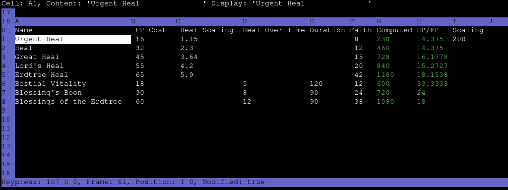

## Overview

  

Spreadsheet Editor is a lightweight, terminal-based editor for TSV
(tab-separated values) files. It supports cell formulas, vim-style navigation,
and a range of keyboard-driven editing commands.

## Features

## Setup

## Usage

### Keybindings

### Formulas

## License

This work is licensed under the GNU General Public License version 3 (GPLv3).

